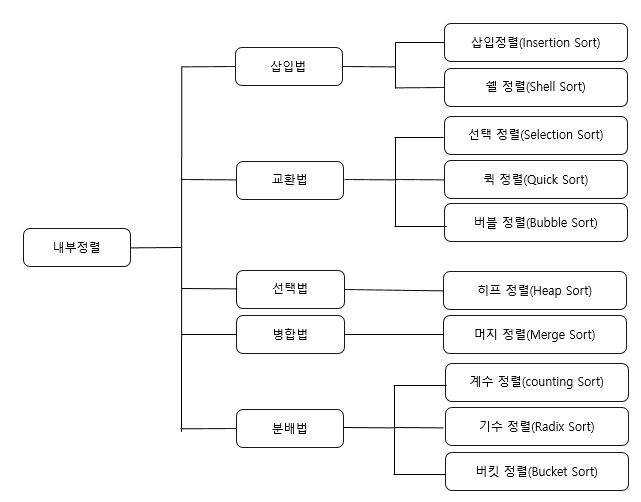

# 정렬과 탐색 알고리즘

- 정렬은 정렬 장소에 따라 내부정렬(Internal Sort)과 외부정렬(External Sort)로 분류한다.
  - 내부정렬 : 소량의 데이터에 대해 주기억 장치에 올려서 정렬하는 방식
    - 정렬 속도는 빠르다
    - 주기억 장치의 용량에 의해 정렬할 수 있는 데이터의 양이 제한
  - 외부정렬 : 대량의 데이터에 대해 보조 기억 장치에서 정렬하는 방식
    - 대량의 데이터를 몇 개의 서브 파일로 나누어 내부 정렬을 한 후 보조기억장치에서 정렬된 각 서브 파일들을 병합하는 방식으로 속도가 느림

|                           정렬방법                           |                             설명                             |           | 수행시간 |          | 추가메모리 |
| :----------------------------------------------------------: | :----------------------------------------------------------: | :-------: | :------: | :------: | :--------: |
|                                                              |                                                              |   최악    |   평균   |   최선   |            |
| [삽입 정렬](https://gmlwjd9405.github.io/2018/05/06/algorithm-insertion-sort.html) | - 데이터가 정렬되어 있다고 가정하고 값을 해당 위치에 삽입하여 정렬하는 방법 |  O(n^2)   |  O(n^2)  |   O(n)   |    없음    |
| [쉘 정렬](https://gmlwjd9405.github.io/2018/05/08/algorithm-shell-sort.html) | - 주어진 자료 리스트를 특정 매개변수 값의 길이를 갖는 부파일(subfile)로 쪼개서, 각 부파일에서 삽입 정렬을 수행 | O(nlog2n) | O(n^1.5) |   O(n)   |    없음    |
| [선택 정렬](https://gmlwjd9405.github.io/2018/05/06/algorithm-selection-sort.html) | - 최소값을 찾아 왼쪽으로 이동시키는데 데이터의 크기(개수)만큼 반복하여 정렬하는 방법 |  O(n^2)   |  O(n^2)  |  O(n^2)  |    없음    |
| [퀵 정렬](https://gmlwjd9405.github.io/2018/05/10/algorithm-quick-sort.html) | - 분할 정복(Divide and Conquer)의 방식으로 고안된 정렬 방법으로 먼저 임의의 기준을 선택하여 그 기준보다 작은 값을 왼쪽에, 큰 값을 오른쪽에 위치시킨 후 다시 임의의 기준을 선택하여 왼쪽과 오른쪽을 반복하여 나누어 가며 정렬하는 방법 - 재귀호출(recursive call)을 사용 |  O(n^2)   | O(nlogn) | O(nlogn) |    없음    |
| [버블 정렬](https://gmlwjd9405.github.io/2018/05/06/algorithm-bubble-sort.html) | - 인접한 데이터 간에 교환이 계속해서 일어나면서 정렬이 이루어지는 방법 |  O(n^2)   |  O(n^2)  |  O(n^2)  |    없음    |
| [힙 정렬](https://gmlwjd9405.github.io/2018/05/10/algorithm-heap-sort.html) | - 최대 히프 트리나 최소 히프 트리를 구성해 정렬을 하는 방법  | O(nlogn)  | O(nlogn) | O(nlogn) |    없음    |
| [머지 정렬](https://gmlwjd9405.github.io/2018/05/08/algorithm-merge-sort.html) | - 분할정복방법을 사용하는데 데이터의 크기를 반으로 계속 나누고 이를 정렬하면서 다시 합치는 방법 | O(nlogn)  | O(nlogn) | O(nlogn) |    있음    |
|      [기수 정렬](https://lktprogrammer.tistory.com/48)       |    - 데이터의 낮은 자리 수부터 비교하여 정렬해 가는 방법     |   O(dn)   |  O(dn)   |  O(dn)   |    있음    |

##### *참고 : 기수정렬의 d는 가장 큰 데이터의 자리수.

## 탐색

- 데이터 집합에서 원하는 항목을 효율적으로 찾는 기법
- 데이터의 **`정렬 여부`**에 따라 **`순차탐색`**, **`제어탐색`**으로 구분

- 특정 함수에 따라 키 값을 계산하여 데이터를 검색하는 해싱
- 따라서, 자료구조의 형태 및 자료의 배열 상태를 고려하여 최적의 탐색 방법을 선택해야 한다.

|              분류방법              | 데이터 정렬 |               종류               |                         내용 및 특징                         |
| :--------------------------------: | :---------: | :------------------------------: | :----------------------------------------------------------: |
|      선형 검색(Linear Search)      |      X      |     선형탐색(Linear Search)      | - 처음부터 마지막까지 순서대로 각 레코드를 비교하면서 찾아가는 방법 - 프로그램 작성이 용이 - 파일의 크기가 커질수록 탐색시간이 증가 - 가장 간단하고 직접적인 검색 방법 -평균비교횟수: (n+1)/2, 평균검색시간: O(n) |
|     제어 검색(Control Search)      |      O      |     이진탐색(Binary Search)      | - 상한값(F)과 하한값(L)을 설정하고 그 중간값(M)을 구한 후 키와 중간 값을 계속 비교하면서 검색하는 방법 - 파일의 탐색 대상을 1/2씩 줄여가면서 탐색하므로 효율적임 - 레코드 수가 많을 수록 효과적임 (최악의 경우라도 비교횟누는 평균횟수보다 한 번 더 많음) - 평균검색시간: O(lon2n) |
|     제어 검색(Control Search)      |      O      |  피보나치탐색(Fibinacci Search)  | - 피보나치 순열을 이용하여 서브 파일을 형성해 가면서 검색하는 방법 - 이진검색은 나눗셈을 이용하나, 피보나치 검색은 덧셈과 뺄셈만으로 검색이 가능하므로 속도가 빠름 - 평균검색시간: O(log2n) |
|     제어 검색(Control Search)      |      O      |  보간탐색(Interpolation Search)  | - 탐색 대상이 있을 것으로 예상되어지는 위치를 선택하여 찾아가는 방식으로 이후 그 위치에서 선형 탐색을 함 - 사전이나 전화번호부, 색인명 등과 같은 탐색에 이용 - 평균적으로 O(longn)의 성능 |
|     제어 검색(Control Search)      |      O      |      블록탐색(Block Search)      | - 전체 데이터를 일정한 개수의 블록으로 구분하고 찾기를 원하는 데이터가 속한 블록을 결정한 후에 해당 블록 내의 키 값을 순차적으로 검색하는 방법 - 효율적인 블록의 크기는 sqrt(n) = 루트n - 프로그램 작성과 갱신이 쉬움 - 평균적으로 O(logn)의 성능 |
|     제어 검색(Control Search)      |      O      | 이진트리탐색(Binary Tree Search) | - 이진 트리를 이용하는 검색방법 - 평균적으로 삽입/검색/삭제 모두 O(logn)의 성능 |
| 특정 함수를 이용하여 접근하는 방식 |      X      |          해싱(Hashing)           | - 해싱함수를 이용하여 데이터가 저장되어 있는 주소를 직접 계산하여 찾아가 검색하는 방법 - 삽입과 삭제가 빈번한 자료에 적합함 |

참고 : [선형 탐색과 이진탐색](https://nittaku.tistory.com/487) // [피보나치 탐색](http://web.skhu.ac.kr/~mckim1/Lecture/DS/dna/class11/class11_05.html) // [보간탐색](https://jackpot53.tistory.com/35) // [이진트리탐색](https://kka7.tistory.com/78)

