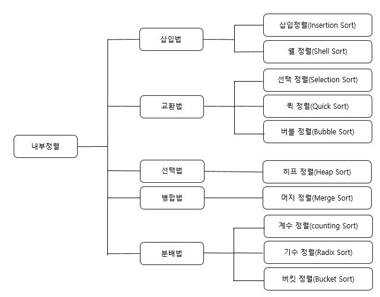

# 정렬과 탐색 알고리즘

- 정렬은 정렬 장소에 따라 내부정렬(Internal Sort)과 외부정렬(External Sort)로 분류한다.
  - 내부정렬 : 소량의 데이터에 대해 주기억 장치에 올려서 정렬하는 방식
    - 정렬 속도는 빠르다
    - 주기억 장치의 용량에 의해 정렬할 수 있는 데이터의 양이 제한
  - 외부정렬 : 대량의 데이터에 대해 보조 기억 장치에서 정렬하는 방식
    - 대량의 데이터를 몇 개의 서브 파일로 나누어 내부 정렬을 한 후 보조기억장치에서 정렬된 각 서브 파일들을 병합하는 방식으로 속도가 느림

|                           정렬방법                           |                             설명                             |           | 수행시간 |          | 추가메모리 |
| :----------------------------------------------------------: | :----------------------------------------------------------: | :-------: | :------: | :------: | :--------: |
|                                                              |                                                              |   최악    |   평균   |   최선   |            |
| [삽입 정렬](https://gmlwjd9405.github.io/2018/05/06/algorithm-insertion-sort.html) | - 데이터가 정렬되어 있다고 가정하고 값을 해당 위치에 삽입하여 정렬하는 방법 |  O(n^2)   |  O(n^2)  |   O(n)   |    없음    |
| [쉘 정렬](https://gmlwjd9405.github.io/2018/05/08/algorithm-shell-sort.html) | - 주어진 자료 리스트를 특정 매개변수 값의 길이를 갖는 부파일(subfile)로 쪼개서, 각 부파일에서 삽입 정렬을 수행 | O(nlog2n) | O(n^1.5) |   O(n)   |    없음    |
| [선택 정렬](https://gmlwjd9405.github.io/2018/05/06/algorithm-selection-sort.html) | - 최소값을 찾아 왼쪽으로 이동시키는데 데이터의 크기(개수)만큼 반복하여 정렬하는 방법 |  O(n^2)   |  O(n^2)  |  O(n^2)  |    없음    |
| [퀵 정렬](https://gmlwjd9405.github.io/2018/05/10/algorithm-quick-sort.html) | - 분할 정복(Divide and Conquer)의 방식으로 고안된 정렬 방법으로 먼저 임의의 기준을 선택하여 그 기준보다 작은 값을 왼쪽에, 큰 값을 오른쪽에 위치시킨 후 다시 임의의 기준을 선택하여 왼쪽과 오른쪽을 반복하여 나누어 가며 정렬하는 방법 - 재귀호출(recursive call)을 사용 |  O(n^2)   | O(nlogn) | O(nlogn) |    없음    |
| [버블 정렬](https://gmlwjd9405.github.io/2018/05/06/algorithm-bubble-sort.html) | - 인접한 데이터 간에 교환이 계속해서 일어나면서 정렬이 이루어지는 방법 |  O(n^2)   |  O(n^2)  |  O(n^2)  |    없음    |
| [힙 정렬](https://gmlwjd9405.github.io/2018/05/10/algorithm-heap-sort.html) | - 최대 히프 트리나 최소 히프 트리를 구성해 정렬을 하는 방법  | O(nlogn)  | O(nlogn) | O(nlogn) |    없음    |
| [머지 정렬](https://gmlwjd9405.github.io/2018/05/08/algorithm-merge-sort.html) | - 분할정복방법을 사용하는데 데이터의 크기를 반으로 계속 나누고 이를 정렬하면서 다시 합치는 방법 | O(nlogn)  | O(nlogn) | O(nlogn) |    있음    |
|      [기수 정렬](https://lktprogrammer.tistory.com/48)       |    - 데이터의 낮은 자리 수부터 비교하여 정렬해 가는 방법     |   O(dn)   |  O(dn)   |  O(dn)   |    있음    |

##### *참고 : 기수정렬의 d는 가장 큰 데이터의 자리수.

