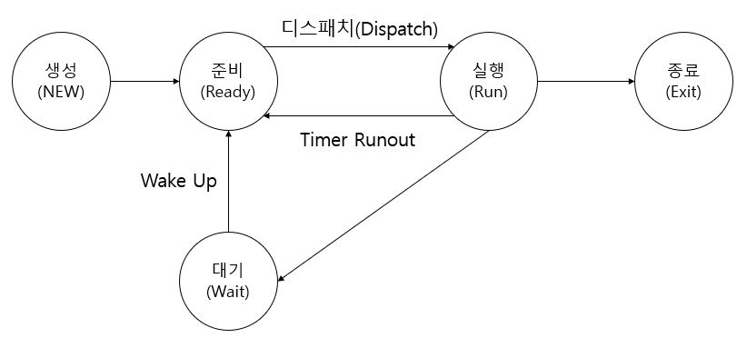
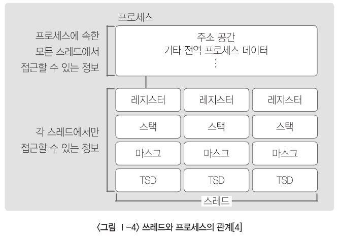

# 운영체제

- 컴퓨터 하드웨어와 응용프로그램간의 중재자 역할을 하는 시스템 소프트웨어

- 프로세서, 메모리, 입출력 장치, 통신 장치 등의 시스템 자원을 효율적으로 관리하며 시스템 및 응용 프로그램의 실행을 지원한다.
- 핵심 구성요소
  - 프로세스 스케쥴러(Process Scheduler)
  - 메모리관리자(Memory Menager)
  - 입출력관리자(I/O Manager)
  - 프로세서간 통신관리자(IPC, InterProcess Communication Manager)
  - 파일시스템관리자(File System Manager)

#### 프로세스( = 작업, 태스크 )

- 실행 중인 프로그램
- 프로세스제어블록(PCB, Process Control Block)을 가진 프로그램
- 운영체제가 관리하는 실행의 단위

##### 1. 프로세스의 상태 ( 생명주기 )

- 생성: 프로세스가 생성되었으나 아직 운영체제에 의해 실행 가능하게 되지 못한 상태

- 준비: 프로세스가 실행을 위해 CPU를 할당 받기를 기다리는 상태
- 실행: 프로세스가 CPU를 차지하고 있는 상태
- 종료: 프로세스의 실행이 끝나고 CPU 할당이 해제된 상태
- 대기: 프로세스가 CPU를 할당 받아 실행되다가 입/출력 완료 등과 같은 어떤 사건이 발생해 주기를 기다리고 있는 상태

##### 2. 프로세스제어블록 ( PCB, Process Control Block )

- 운영체제가 프로세스 관리를 위해 필요한 정보를 저장하는 것
- 프로세스가 생성될 때마다 고유의 PCB가 생성되고 프로세스가 완료되면 PCB는 제거된다.
- `프로세스 식별번호(PID)`, `프로세스 상태`, `프로그램 카운터(다음에 실행할 명령어를 가리키는 값)`, `스케줄링 우선 순위`,`레지스터 정보`, `주기억 장치 관리 정보` 등이 포함된다.

##### 3. 쓰레드(Thread)

- 프로세스 내에서의 작업 단위
- 시스템의 여러 자원을 할당 받아 실행하는 프로그램의 단위
- 프로세스 생성과 달리 운영체제가 부모 프로세스와 공유할 자원을 초기화할 필요가 없으므로 쓰레드의 생성과 종료를 위한 오버헤드가 적다.

##### * 출처 : TOPCIT 에센스

#### 병행 프로세스

- 두 개 이상의 프로세스가 동시에 처리하는 것
- 공유자원에 대한 배타적인 접근이 보장되지 않는다면 오류 발생시 커다란 문제가 야기될 수 있다.
- 이러한 오류를 방지하기 위한 해결책으로 임계영역, 상호 배제, 세마포어, 모니터와 같은 방법들이 있다.

##### 1. 임계 영역(Critical Section)

- 다중 프로그래밍 운영체제에서 여러 개의 프로세스가 공유하는 데이터 및 자원에 대하여 특정 작업 시점에서는 하나의 프로세스만 자원 또는 데이터를 사용하도록 허용된 영역이다.

##### 2. 상호 배제(Mutual Exclusion)

- 여러 개의 프로세가 공유 자원을 액세스 할 때 작업을 정당하게 실행하기 위해 한 순간에 하나의 프로세스만 변경할 수 있도록 하는 기법
  - 상호 배제 문제에 대한 해결 방법
    - 소프트웨어적인 해결(Dekker 알고리즘, Peterson 알고리즘)
    - 하드웨어적인 해결(인터럽트 비활성화, 테스트 후 설정(Test-and-Set) 명령어, Compare-and Swap 명령어)

##### 3. 세마포어(Semaphore)

- 임계 영역에서 프로세스가 작업을 수행하더라도 올바른 결과를 산출할 수 있도록 데이터의 정확성과 일관성을 보장하는 것
- Dijkstra에 의해 고안된 상호 배제를 이루는 방법
- 보호변수 P(Wait)와 V(Signal)의 두가지 연산에 의해서만 액세스될 수 있도록 통제하는 방법

##### 4. 모니터(Monitor)

- 운영체제에서 지원하는 세마포어와는 다르게 병행 다중 프로그래밍에서 상호 배제를 구현하기 위한 특수한 프로그래밍 기법으로 공유 자원을 정당하게 할당하기 위한 병행성 구조