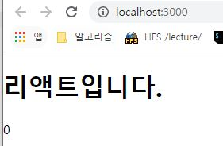
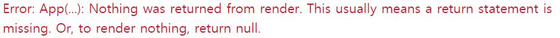

# 리액트 ( react )

#### 특징

- 자바스크립트 라이브러리로 사용자 인터페이스를 만드는데 사용된다.
- 오직 `View`만 신경 쓰는 라이브러리
- Virtual DOM을 사용한다.
- 다른 프레임워크와 혼용 가능하다.

### 컴포넌트 ( component )

- 특정 부분이 어떻게 생길지 정하는 선언체
- 재사용이 가능한 API

### 1. 렌더링 ( randering )

- 사용자 화면에 View를 보여주는 것

#### 1-1. 초기 렌더링

```react
// 리액트에서 사용하는 렌더링 함수
// View의 생김새와 작동 정보를 지닌 객체를 반환한다.
	
	render() { ... }

/*  초기 렌더링
	렌더링 => HTML 마크업 <div> ... </div> => DOM 주입
*/
```

#### 1-2. 조화 과정 ( reconclilation )

- 컴포넌트에서 데이터에 변화가 생길 경우 뷰의 변형이 아닌 새로운 요소로 갈아 끼운다.
- 업데이트한 값을 수정하는 것이 아닌 새로운 데이터를 가지고 render 함수를 재호출한다.
- 결과를 DOM에 반영하지 않고 이전 컴포넌트와 현재 생성된 컴포넌트 정보를 비교 후 최소한의 연산으로 DOM  트리를 업데이트 한다.

#### ReactDOM.render

- 컴포넌트를 페이지에 렌더링하는 역할
- react-dom 모듈을 불러와 사용할 수 있다.

```react
import React from 'react';
import ReactDOM from 'react-dom';
import './index.css';
import App from './App';
import * as serviceWorker from './serviceWorker';

// 1번째 인자 : 렌더링할 내용을 JSX형태도 작성
// 2번째 인자 : 해당 JSX를 렌더링할 document 내부 요소 설정
ReactDOM.render(<App />, document.getElementById('root'));

serviceWorker.unregister();

```


### 2. Virtual DOM

#### 2-1. DOM ( Document Object Model )

- 객체로 문서 구조를 표현하는 방법으로 XML이나 HTML로 작성한다.
- 트리 형태이다.
- 동적 UI에 최적화 되어 있지 않다.

#### 문제점

- 웹 브라우저 단에서 DOM의 변화가 일어날 경우 CSS 재연산, 레이아웃 구성, 페이지를 repaint한다 => 느려진다.

#### 해결법

- HTML 마크업을 시각적인 형태로 변환하는 것은 웹 브라우저의 역할
- DOM을 최소한으로 조작하여 작업을 처리하는 방식을 통해 속도 개선

#### 2-2. Virtual DOM

- 실제 DOM에 접근하여 조작하는 대신, 이를 추상화한 자바스크립트 객체를 구성하여 사용

#### DOM 업데이트 절차

1. 데이터를 업데이트하면 전체 UI를 Virtual DOM에 리렌더링한다.
2. 이전 Virtual DOM에 있던 내용과 현재 내용을 비교
3. 바뀐 부분만 실제 DOM에 적용.

#### 오해

- Virtual DOM의 사용이 무조건 빠르게 하는 것이 아니다.


### 3. 번들러( bundler )

- `import` 구문을 통해 리액트 모듈을 불러와 사용 가능하다.
- 브라우저 상에서 모듈을 불러와서 사용하는 것은 지원되지 않는다. 
- **But**, 모듈을 브라우저 상에서 사용가능하게 하는 기능 == 브라우저가 아닌 환경에서 자바스크립트를 실행할 수 있게 해주는 환경인 Node.js에서 지원하는 기능
- **즉,** 브라우저에서도 모듈을 사용하기 위해 **`번들러(bundler)`**를 사용한다.
- **Webpack**, Parcel, browserify 등의 도구들이 있다.
  - Webpack - 로더(loader)라는 기능이 SVG파일과 CSS파일들을 불러온다.
    - css-loader : CSS파일을 불러올 수 있게 해준다
    - file-loader : 웹 폰트나 미디어 파일 등을 불러올 수 있게 해준다.
    - babel-loader : 자바스크립트 파일들을 불러오면서 최신 자바스크립트 문법으로 작성된 코드를 바벨이라는 도구를 사용하여 ES5 문법으로 변환 해준다.
- `import`로 불러온 모듈들을 합쳐 하나의 파일을 생성해준다.


### 4. JSX ( javascript extension)

- 자바스크립트의 확장 문법으로 XML과 비슷하게 생겼다.

#### 번들링 과정

```react
function App() {
	return {
        <div>
        	Hello <b>react</b>
        </div>
    }	
}

// babel을 통해 ES5로 변환된 코드
function App() {
    return React.createElement("div",null,"Hello", 						
								React.createElement("b",null,"react")
							  );
}

```

### 장점

- 보기 쉽고 익숙하다
- 높은 활용도


### 문법

#### 1. 감싸인 요소

- Virtual DOM에서 컴포넌트 변화 감지의 효율성을 높이기 위한 규칙

```react
//1. 오류 코드
import React from 'react';

// 여러 요소가 부모 요소 하나에 감싸져 있지 않기 때문에 오류 발생
function App() {
  return (
    <h1>리액트 안녕!!</h1>
    <h2>잘 작동하니?</h2>
  )
}

export default App;

//2. 해결 코드
import React from 'react';

// div 요소 즉, 부모요소를 만들어 오류 해결
function App() {
  return (
    <div>
    <h1>리액트 안녕!!</h1>
    <h2>잘 작동하니?</h2>
    </div>
  )
}

export default App;

```

#### 2.자바스크립트 표현

- JSX 내부에서 자바스크립트 표현식을 사용할 수 있다 
- `{ }`로 코드를 감싸 사용한다.

```react
import React from 'react';

function App() {
    const name = "리액트";
    return (
        <>
        	<h1>{name} 안녕!</h1>
        	<h2>잘 작동하니?</h2>
        </>
    );
}
```


#### 3. if문 대신 조건부 연산자

- JSX 내부의 자바스크립트 표현식에서 if문을 사용할 수 없다.

```react
import React from 'react';


function App() {
  const name = '리액트';
  return (
    <>
    {name === '리액트' ? (
     <h1>리액트입니다.</h1>) : (
  	 <h2>리액트가 아닙니다.</h2>
    )}
    </>
  );
}

export default App;

```

#### 4. AND 연산자(&&)를 사용한 조건부 렌더링

- falsy한 값 0은 예외적으로 화면에 나타난다.

```react
import React from 'react';

// null을 렌더링하면 아무것도 보여 주지않는다.
function App() {
  const name = '뤼왝트';
  return (
    <>
    {name === '리액트' ? <h1>리액트입니다.</h1> : null }
    </>
  );
}

export default App;

// 조건 && expression 표현식
// 조건에 따라 expression을 반환한다.
import React from 'react';


function App() {
  const name = '리액트';
  const number = 0;

  return (
    <>
    {name === '리액트' && <h1>리액트입니다.</h1> }
    {number && <div>예외값인 0이다!!!</div>}
    </>
  );
}

export default App;

// 예외값 0은 boolean으로 false로 처리되고 화면에 숫자 0을 출력한다.
```




#### 5. undefined를 렌더링하지 않기

- 컴포넌트에서는 함수에서 undefined만 반환하여 렌더링하는 상황을 만들면 안된다.

```react
import React from 'react';
import './App.css';

function App() {
    const name = undefined;
    return name;
}

export default App;
```

- 아래와 같은 오류 발생



- 어떤 값이 undefined일 수도 있다면,
  **`OR(||)`** 연산자를 사용하면 해당 값이 undefined일 떄 사용할 값을 지정할 수 있다.

```react
import React from 'react';
import './App.css';

function App() {
    const name = undefined;
    return name || '값이 undefined입니다.';
}

export default App;
```

- JSX 내부에서 undefined를 렌더링 하는 것은 괜찮다.

```react
import React from 'react';
import './App.css';

function App() {
    const name = undefined;
    return <div>{name || '리액트'}</div>;
}

export default App;
```


#### 6. 인라인 스타일링

- 문자열 형태의 스타일 적용이 아닌 **`객체` **형태의 스타일 적용
- `background-color`와 같이 `-`문자가 포함된 이름은 **`카멜 표기법`**으로 작성한다.

```react
// 객체 선언후 사용
import React from 'react';

function App() {
	const name = "리액트";
    const style = {
        backgroundColor : 'black',	// background-color => backgroundColor
        color : 'aqua',
        fontSize: '48px',	// font-size => fontSize
        fontWeight: 'bold', // font-weight => fontWeight
        padding: 16 // 단위를 생략하면 px로 지정된다.
    }
    return <div style={style}>{name}</div>
}

export default App;

// 바로 사용
import React from 'react';

function App() {
	const name = "리액트";    
    return ( 
        <div style={{
                // background-color => backgroundColor
                backgroundColor : 'black',	
                color : 'aqua',
                fontSize: '48px',	// font-size => fontSize
                fontWeight: 'bold', // font-weight => fontWeight
                padding: 16 // 단위를 생략하면 px로 지정된다.
        	}}
        >
           {name}
        </div>
    );
}

export default App;
```


#### 7. class 대신 className

```react
//src/App.css
.react {
  background: aqua;
  color: black;
  font-size: 48px;
  font-weight: bold;
  padding: 16px;
}

import React from 'react';
import './App.css';

function App() {
	const name = "리액트";    
    return ( 
        <div className="react">
           {name}
        </div>
    );
}

export default App;
```


#### 8. 꼭 닫아야 하는 태그

- HTML 코드 경우

```html
<!-- 닫기 태그가 없는 경우에도 실행에 문제가 없다 -->
<form>
    성: <br>
    <input><br>
    이름: <br>
    <input><br>
</form>
```

- JSX 코드 경우

```react
// input태그의 닫는 태그가 없어 컴파일 오류 발생
import React from 'react';
import './App.css';

function App() {
	const name = "리액트";    
    return ( 
        <>
            <div className="react">{name}</div>
        	<input>
        </>
    );
}

export default App;    

```

```react
// input 닫는 태그를 작성 후 작동
import React from 'react';
import './App.css';

function App() {
	const name = "리액트";    
    return ( 
        <>
            <div className="react">{name}</div>
        	<input></input>
        </>
    );
}

export default App;      
```


#### 9. 주석

- JSX 내부에서 주석 작성하는 방법
- {/* .... */} 형식으로 주석을 작성할 수 있다.

```react
// input 닫는 태그를 작성 후 작동
import React from 'react';
import './App.css';

function App() {
	const name = "리액트";    
    return ( 
        <>
        	{/* 주석은 이렇게 작성합니다. */}
            <div 
                className="react" // 시작 태그를 여러 줄로 작성할 경우 
								  // 여기에 주석을 작성할 수 있다
            >{name}
        	</div>
        	// 하지만 이런 주석이나
        	/* 이런 주석은 페이지에 그대로 나타나게 된다. */
        	<input/>
        </>
    );
}

export default App;      
```


#### 참고 정의

```
babel : ECMAScript 6를 호환시켜 준다.
webpack : 모듈화된 코드를 한 파일로 합치고(bundling) 코드를 수정할 때마다 
		  웹 브라우저를 리로딩하는 등의 여러 기능을 지닌 것
```

